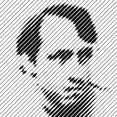

<head profile="http://www.w3.org/2005/10/profile">
  <meta charset="UTF-8">
  <title>Nic Werneck Homepage</title>
  <link rel="shortcut icon" href="/~nlw/img/favicon.ico" type="image/x-icon" />
  <link rel="stylesheet" type="text/css" href="css/estilo.css" media="screen" />
</head>

[Main](index.html) | [Publications](publications.html)

nic homepage
============

  

    

      
        Nicolau&nbsp;Leal&nbsp;Werneck
      
       
      
        <a href="mailto:nwerneck@gmail.com">nwerneck@gmail.com</a> 
      
       
    

    

      
    

  

## Intro
I am an electrical engineer, and I obtained my doctorate at USP in 2012 supervised by [Anna Helena Reali Costa](http://www.lti.pcs.usp.br/~anna/). See my <a href="./nic-cv.pdf" onClick="javascript: pageTracker._trackPageview('./nic-cv.pdf'); ">resume</a> for more information.

**Main research interests:** pattern recognition, machine learning, computer vision, signal processing, optimization and computation in general.

## Research work
_A few selected publications:_

[Corisco: Robust edgel-based orientation estimation for generic camera models](./almoxarifado/imavis2013-final.pdf) (2013)
:    Nicolau Leal Werneck and Anna Helena Reali Costa. [_Image and VIsion Computing_](http://dx.doi.org/10.1016/j.imavis.2013.10.004) 31(12), pp. 969–-981.

[Mapping with monocular vision in two dimensions](./almoxarifado/WerneckCosta10.pdf) (2010)
:    Nicolau Leal Werneck and Anna Helena Reali Costa. [_International Journal of Natural Computing Research_](http://dx.doi.org/10.4018/jncr.20101001) 1(4), pp. 56--65.

[Speeding up probabilistic inference of camera orientation by function approximation and grid masking](./almoxarifado/nic-wscg2011.pdf) (2011)
:    Nicolau Leal Werneck and Anna Helena Reali Costa. [_19th International Conference on Computer Graphics, Visualization and Computer Vision - WSCG'2011_](http://wscg.zcu.cz/WSCG2011/wscg2011.htm). WSCG2011 Communication proceedings.

[Monocular visual mapping with the Fast Hough Transform](./almoxarifado/72827.pdf) (2010)
:    Nicolau Leal Werneck and Anna Helena Reali Costa. [_Anais do VI Workshop de Visão Computacional_](http://iris.sel.eesc.usp.br/wvc/), ISSN: 2175-6120.

See more at the [publications section](./publications.html).

## Projects
[Coffeecraft](http://nic.hpavc.net/coffeecraft/)
:    Small Akka-http + Dart application. Sources available [at GitHub](https://github.com/nlw0/scala-coffeecraft).

[Sharelody](http://nic.hpavc.net/piano/)
:    WIP, right now it is just a Dart based piano that can record and play back.

More stuff at [my GitHub account](https://github.com/nlw0).

## Blogs
[xor](http://xor0110.wordpress.com)
:    Mostly about programming and technology. Whenever I have some cool piece of code I want to show other people, I talk about it here.

[Sufficient and Necessary Conditions](http://www.scilogs.com/sufficient_and_necessary_conditions/)
:    My blog at SciLogs. About how science affects our lives and vice-versa. Kind of hibernating right now. 

## Elsewhere on the net

[Twitter](https://twitter.com/nwerneck)
:    Mostly news retweets and bad jokes.

[GitHub](https://github.com/nlw0)
:    A few small projects and experiments, mostly.

[Hackerrank](https://www.hackerrank.com/xor0110)
:    I love my badges! Trying to reach 90th percentile on Algorithms and FP right now.

[LinkedIn](https://www.linkedin.com/in/nwerneck)
:    Some more professional information.

[Google Plus](https://plus.google.com/113933651089797572744/posts)
:    Usually not very active, but some interesting news sometimes that I only see there. Also a good place to post large content unfit for twitter.

## Contact
I try to make all my work available in this webpage, but it is usually outdated. If you wish to contact me, please send an email with a reasonable subject to [nwerneck@gmail.com](mailto:nwerneck@gmail.com) or [nwerneck@sdf.org](mailto:nwerneck@sdf.org). Here is my [public PGP key](./pubkey-nwerneck.asc).
